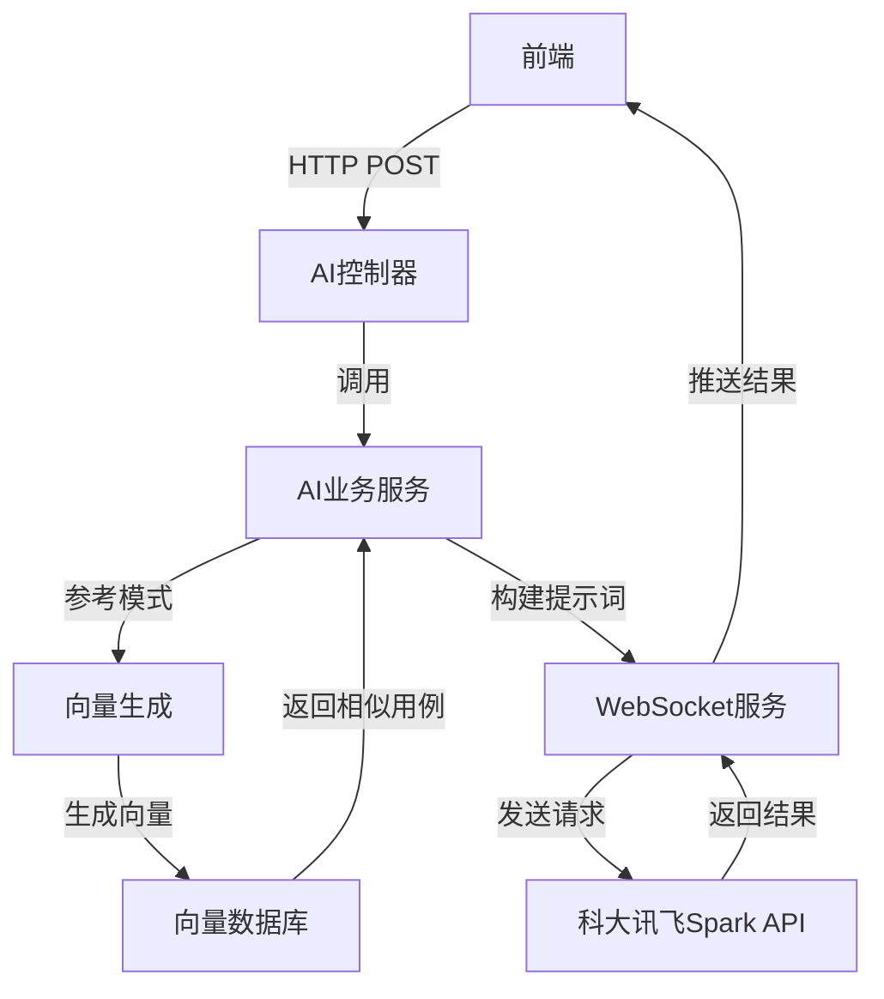
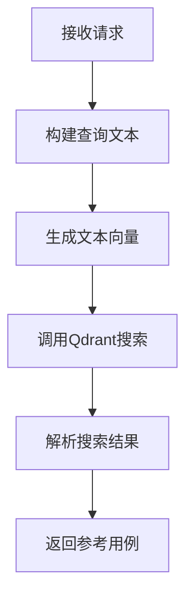
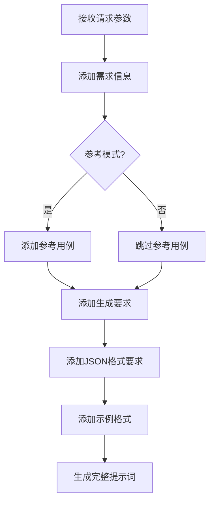
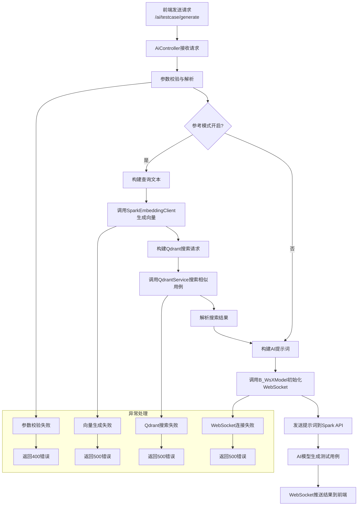

# AI生成测试用例技术方案

## 知识库性质说明

**技术属性**：RAG（检索增强生成）知识库

**精准描述**：本知识库采用检索增强生成技术，通过向量数据库存储和检索相关知识，结合AI模型生成高质量测试用例。核心工作原理是将用户输入转化为向量，在知识库中检索相关信息，然后将检索结果与用户需求整合为提示词，送入AI模型生成针对性输出。

**应用场景**：
- 智能问答：基于知识库内容快速回答测试相关问题
- 内容创作辅助：为测试文档、报告生成提供智能建议
- 专业知识查询：快速检索测试领域的专业知识和最佳实践
- 测试用例生成：根据需求自动生成标准化测试用例
- 缺陷分析辅助：基于历史缺陷数据提供分析和建议

**主要特点**：
- 知识更新机制：支持增量更新和实时索引，确保知识库内容的时效性
- 检索效率：采用向量数据库和语义搜索，实现毫秒级响应
- 生成准确性：通过参考模式和多维度评分，提高生成内容的相关性和准确性
- 可扩展性：支持多模态内容处理和领域特定模型集成


## 1. 系统架构



## 2. 技术选型

| 类别 | 技术 | 版本 | 说明 |
|------|------|------|------|
| 基础框架 | Spring Boot | 2.7.18 | 提供自动配置和快速开发能力 |
| AI服务 | 科大讯飞Spark API | - | 提供AI对话和嵌入能力（当前为调试用临时模型，后续将进行替换） |
| 向量数据库 | Qdrant | - | 存储和检索测试用例向量 |
| 通信方式 | WebSocket | - | 实现异步通信 |
| JSON处理 | FastJSON | 1.2.83 | 处理JSON数据 |
| HTTP客户端 | OkHttp3 | 4.12.0 | 发送HTTP请求 |

**说明**：当前使用的AI模型为调试用临时模型，主要用于功能验证和流程测试。后续将根据实际需求和性能表现，选择更适合的模型方案，包括但不限于更先进的大语言模型、领域特定模型等。

## 3. 核心流程

### 3.1 测试用例生成流程

1. **接收请求**：前端通过`/ai/testcase/generate`接口发送测试用例生成请求，包含模块、用户故事、验收标准等信息

2. **参考模式处理**：
   - 如果开启参考模式，构建查询文本
   - 调用Spark Embedding API生成文本向量
   - 调用Qdrant向量数据库检索相似测试用例

3. **构建提示词**：
   - 整合需求信息
   - 添加参考用例（如果有）
   - 明确生成要求和格式规范

4. **调用AI模型**：
   - 通过WebSocket调用科大讯飞Spark API
   - 发送构建好的提示词

5. **结果处理**：
   - AI模型生成测试用例
   - 通过WebSocket将结果推送给前端

### 3.2 关键流程详细说明

#### 3.2.1 参考模式检索流程



#### 3.2.2 AI提示词构建流程



#### 3.2.3 业务流程详细说明



### 3.3 待实现功能模块

#### 3.3.1 参考文档节选功能（待实现）

**语义感知分割技术实现**：
- 开发基于文档逻辑结构的动态分块算法，能够识别章节标题、段落边界等文档固有结构特征
- 实现智能内容分割，彻底解决固定长度切割导致的语义断裂问题
- 支持多种文档格式（Markdown、Word、PDF等）的结构化解析

**重叠补偿机制实施**：
- 设计相邻分块重叠策略，在分块边界处保留前段内容的适当比例作为重叠区域
- 确保上下文信息的连贯性和语义完整性
- 动态调整重叠比例，根据文档类型和内容复杂度自动优化

**模态向量嵌入应用**：
- 对分割后的文档片段实施多模态向量嵌入处理
- 确保不同类型内容（文本、表格等）的有效向量化表示
- 为不同模态内容设计专门的嵌入策略，提高检索精度

#### 3.3.2 领域适配模型选择机制（待实现）

**通用场景配置**：
- 选用轻量级预训练模型all-MiniLM-L6-v2作为基础嵌入模型
- 确保在通用领域的高效语义表示
- 优化模型推理速度，满足实时响应需求

**专业领域配置**：
- 针对金融、医疗等专业领域，集成领域特定微调模型
- 医疗领域采用BioBERT，金融领域采用FinBERT等专业模型
- 显著提升专业术语和领域知识的语义理解精度
- 支持模型自动切换机制，根据输入内容自动选择最合适的模型

#### 3.3.3 智能重排序功能（待实现）

**LLM辅助评分机制集成**：
- 部署适当规模的轻量级LLM对检索到的候选文档集进行二次排序优化
- 利用LLM的语义理解能力，对检索结果进行深度评估
- 实现评分过程的并行处理，确保不影响整体响应速度

**多维评分体系构建**：
1. **语义相关度**：通过余弦相似度等算法评估文档片段与查询（query）的语义一致性程度
2. **信息冗余度**：开发重复内容识别算法，自动过滤重复率超过一定阈值的相似文档片段
3. **时效性权重**：设计基于文档更新时间的动态权重计算模型，优先展示最新更新的内容
4. **权威性评估**：根据文档来源和作者信息，为文档片段分配权威性得分
5. **覆盖度分析**：评估检索结果对查询意图的覆盖程度，确保信息完整性

#### 3.3.4 缺陷知识入库机制（待实现）

**缺陷信息自动处理流程**：
- 建立测试过程中发现的缺陷信息自动入库流程
- 参照文档处理步骤对缺陷信息进行标准化处理
- 提取缺陷的关键信息，包括缺陷描述、复现步骤、影响范围等

**缺陷知识向量化**：
- 对处理后的缺陷信息进行向量嵌入处理
- 构建缺陷知识的语义表示，便于后续检索和利用
- 为缺陷信息添加标签和分类，提高检索效率

**缺陷知识应用**：
- 将缺陷知识存入向量数据库，作为大模型推理的补充知识源
- 在测试用例生成过程中，参考相关缺陷信息，提高测试用例的针对性
- 支持基于缺陷知识的测试重点推荐，帮助测试人员关注高风险区域


## 4. 核心组件

### 4.1 AiController

**功能**：提供AI相关的HTTP接口

**关键方法**：
- `generateTestCase(TestCaseGenerateRequest request)`：测试用例生成接口
- `callSpark(Map<String, String> request)`：调用Spark API接口

**路径**：`src/main/java/com/grape/grape/controller/AiController.java`

### 4.2 TestCaseGenerateRequest

**功能**：测试用例生成请求参数模型

**关键字段**：
- `module`：模块名称
- `userStory`：用户故事
- `acceptanceCriteria`：验收标准
- `boundaryConditions`：边界条件
- `relatedModules`：相关模块
- `testDimensions`：测试维度
- `caseType`：用例类型
- `caseCount`：用例数量
- `referenceMode`：参考模式
- `similarityThreshold`：相似度阈值
- `generateMode`：生成模式
- `caseTemplate`：用例模板
- `coverageRequirements`：覆盖要求

**路径**：`src/main/java/com/grape/grape/model/vo/TestCaseGenerateRequest.java`

### 4.3 AiBizService

**功能**：AI业务服务接口

**关键方法**：
- `generateTestCase(TestCaseGenerateRequest request)`：生成测试用例
- `callSpark(String question)`：调用Spark API

**路径**：`src/main/java/com/grape/grape/service/biz/AiBizService.java`

### 4.4 AiBizServiceImpl

**功能**：AI业务服务实现

**关键方法**：
- `generateTestCase(TestCaseGenerateRequest request)`：生成测试用例的核心实现
- `buildQueryText(TestCaseGenerateRequest request)`：构建查询文本
- `buildPrompt(TestCaseGenerateRequest request, List<Map<String, Object>> referenceCases)`：构建AI提示词
- `parseSearchResult(String searchResult)`：解析搜索结果

**路径**：`src/main/java/com/grape/grape/service/biz/AiBizServiceImpl.java`

### 4.5 B_WsXModel

**功能**：WebSocket通信服务

**关键方法**：
- `initWebSocket(RoleContent roleContent, String serviceType)`：初始化WebSocket连接

**路径**：`src/main/java/com/grape/grape/service/ai/B_WsXModel.java`

### 4.6 SparkEmbeddingClient

**功能**：生成文本向量

**关键方法**：
- `getEmbedding(String text)`：获取文本的向量表示

**路径**：`src/main/java/com/grape/grape/service/ai/SparkEmbeddingClient.java`

**说明**：当前使用的Spark Embedding模型为调试用临时模型，后续将根据性能和精度需求进行优化或替换。

### 4.7 QdrantService

**功能**：向量数据库操作

**关键方法**：
- `searchPoints(String collectionName, Map<String, Object> searchRequest)`：搜索相似向量

**路径**：`src/main/java/com/grape/grape/service/QdrantService.java`

## 5. 关键算法

### 5.1 文本向量生成算法

使用科大讯飞Spark Embedding API将文本转换为向量表示：

1. 接收输入文本（模块+用户故事+验收标准+边界条件）
2. 调用Spark Embedding API生成向量
3. 返回向量结果用于相似度搜索

### 5.2 相似度搜索算法

使用Qdrant向量数据库进行相似度搜索：

1. 构建搜索请求（向量、限制数量、相似度阈值）
2. 调用Qdrant搜索接口
3. 解析搜索结果，提取相似用例
4. 返回参考用例列表

### 5.3 AI提示词构建算法

构建高质量的AI提示词：

1. 整合需求信息（模块、用户故事、验收标准等）
2. 添加参考用例（如果有）
3. 明确生成要求（数量、模式、模板等）
4. 规定JSON输出格式
5. 添加示例格式
6. 生成完整提示词

## 6. API接口

### 6.1 测试用例生成接口

**路径**：`/ai/testcase/generate`

**方法**：POST

**请求参数**：
```json
{
  "module": "用户管理模块",
  "userStory": "作为管理员，我希望能够添加新用户，以便管理系统用户",
  "acceptanceCriteria": "1. 能够添加新用户 2. 能够设置用户角色 3. 能够设置用户权限",
  "boundaryConditions": "1. 用户名长度限制为3-20个字符 2. 密码长度限制为6-20个字符 3. 角色必须是系统预定义的角色",
  "relatedModules": "权限管理模块",
  "testDimensions": ["功能测试", "边界测试", "异常测试"],
  "caseType": "功能测试用例",
  "caseCount": 5,
  "referenceMode": true,
  "similarityThreshold": 0.8,
  "generateMode": "详细模式",
  "caseTemplate": "标准模板",
  "coverageRequirements": ["功能覆盖", "边界覆盖", "异常覆盖"]
}
```

**响应参数**：
```json
{
  "code": 200,
  "message": "success",
  "data": [
    {
      "case_id": "1",
      "title": "测试用例生成中",
      "steps": ["提示：测试用例正在生成中", "结果将通过WebSocket推送给前端"],
      "expected": "请等待WebSocket推送的测试用例结果"
    }
  ]
}
```

### 6.2 WebSocket通信

**路径**：`/ws/ai`

**消息格式**：
```json
{
  "serviceType": "test_case_generator",
  "data": {
    "test_cases": [
      {
        "case_id": "1",
        "title": "正常添加用户",
        "steps": [
          "1. 登录系统，进入用户管理模块",
          "2. 点击【添加用户】按钮",
          "3. 输入有效的用户名、密码和角色",
          "4. 点击【保存】按钮"
        ],
        "expected": "用户添加成功，系统显示成功提示，新用户出现在用户列表中"
      }
    ]
  }
}
```

## 7. 技术优势

1. **智能化**：利用AI技术自动生成测试用例，减少人工编写的工作量
2. **个性化**：支持多种生成模式和模板，满足不同场景的需求
3. **参考增强**：通过向量数据库检索相似用例作为参考，提高生成质量
4. **实时性**：使用WebSocket实现异步通信，提高响应速度
5. **标准化**：统一的JSON格式输出，便于后续处理和存储

## 8. 使用场景

1. **需求变更**：当需求发生变更时，快速生成新的测试用例
2. **新功能开发**：为新开发的功能生成测试用例
3. **回归测试**：为现有功能生成回归测试用例
4. **测试覆盖**：针对特定的测试维度生成测试用例
5. **参考学习**：通过参考模式学习现有的测试用例编写风格

## 9. 性能优化

1. **向量缓存**：缓存常用文本的向量表示，减少API调用
2. **批量处理**：批量生成向量和搜索，提高效率
3. **异步处理**：使用WebSocket实现异步通信，避免阻塞
4. **超时处理**：设置合理的超时时间，避免长时间等待
5. **错误重试**：实现错误重试机制，提高稳定性

## 10. 未来扩展

1. **多模型支持**：支持多种AI模型，如GPT、Claude等
2. **自定义模板**：允许用户自定义测试用例模板
3. **测试用例管理**：集成测试用例管理功能，支持保存和编辑
4. **测试执行**：集成测试执行功能，自动执行生成的测试用例
5. **智能分析**：分析测试结果，提供改进建议

## 11. 代码示例

### 11.1 生成测试用例示例

```java
// 前端调用示例
const request = {
  module: "用户管理模块",
  userStory: "作为管理员，我希望能够添加新用户",
  acceptanceCriteria: "1. 能够添加新用户 2. 能够设置用户角色",
  boundaryConditions: "用户名长度限制为3-20个字符",
  testDimensions: ["功能测试", "边界测试"],
  caseCount: 3,
  referenceMode: true
};

fetch('/ai/testcase/generate', {
  method: 'POST',
  headers: {
    'Content-Type': 'application/json'
  },
  body: JSON.stringify(request)
})
.then(response => response.json())
.then(data => {
  console.log('Response:', data);
  // 结果会通过WebSocket推送
});

// WebSocket监听
const ws = new WebSocket('ws://localhost:8080/ws/ai');
ws.onmessage = function(event) {
  const data = JSON.parse(event.data);
  if (data.serviceType === 'test_case_generator') {
    console.log('Generated test cases:', data.data.test_cases);
    // 处理生成的测试用例
  }
};
```

### 11.2 后端处理示例

```java
// 核心处理逻辑
@Override
public Map<String, Object> generateTestCase(TestCaseGenerateRequest request) {
    Map<String, Object> response = new HashMap<>();
    try {
        // 1. 接收请求参数
        if (request == null) {
            response.put("code", 400);
            response.put("message", "Request parameters cannot be empty");
            return response;
        }

        // 2. 如果参考模式=true
        List<Map<String, Object>> referenceCases = new ArrayList<>();
        if (request.isReferenceMode()) {
            // 构建检索向量
            String queryText = buildQueryText(request);
            List<Double> embedding = sparkEmbeddingClient.getEmbedding(queryText);

            if (embedding != null && !embedding.isEmpty()) {
                // 调用向量数据库（qdrant）检索相似用例
                Map<String, Object> searchRequest = new HashMap<>();
                searchRequest.put("vector", embedding);
                searchRequest.put("limit", request.getCaseCount());
                searchRequest.put("score_threshold", request.getSimilarityThreshold());

                String searchResult = qdrantService.searchPoints("test_case_memory", searchRequest);
                if (searchResult != null) {
                    // 解析搜索结果，获取top N条相似用例作为参考
                    referenceCases = parseSearchResult(searchResult);
                }
            }
        }

        // 3. 构建AI提示词
        String prompt = buildPrompt(request, referenceCases);

        // 4. 调用AI模型API
        Map<String, Object> aiResponse = callSpark(prompt, "test_case_generator");

        // 5. 解析AI返回的JSON结果
        List<Map<String, Object>> generatedCases = new ArrayList<>();
        
        // 添加一个提示用例，说明结果会通过WebSocket推送
        Map<String, Object> infoCase = new HashMap<>();
        infoCase.put("case_id", "1");
        infoCase.put("title", "测试用例生成中");
        infoCase.put("steps", Arrays.asList("提示：测试用例正在生成中", "结果将通过WebSocket推送给前端"));
        infoCase.put("expected", "请等待WebSocket推送的测试用例结果");
        generatedCases.add(infoCase);

        // 6. 返回生成的用例列表
        response.put("code", 200);
        response.put("message", "success");
        response.put("data", generatedCases);
    } catch (Exception e) {
        e.printStackTrace();
        response.put("code", 500);
        response.put("message", "Failed to generate test cases: " + e.getMessage());
    }
    return response;
}
```

## 12. 下一版本规划

### 12.1 系统架构概述

设计一个由A、B、C三个模型组成的协同进化智能决策系统，通过生成-校验-仲裁的三角循环机制，平衡创造力与严谨性，实现系统整体性能的持续提升。该架构包含模型间的制衡与反馈循环，最终形成具备自我优化能力的智能决策系统。

### 系统架构示意图（带步骤序号）

```
+-------------------+     1.生成初始用例     +-------------------+
| 模型A：用例生成器 | ---------------------> | 模型B：校验抬杠器 |
+-------------------+                        +-------------------+
        ^                                                |
        |                                                |
        | 4.最终决策                                     | 2.识别漏洞并输出矛盾点
        |                                                |
        |                                                v
+-------------------+     3.反馈优化     +-------------------+
| 模型C：仲裁学习器 | <------------------ |                   |
+-------------------+                        +-------------------+
        |
        | 5.更新知识
        v
+-------------------+
| Qdrant向量库      |
+-------------------+
        |
        | 6.数据支持
        v
+-------------------+
| 模型A：用例生成器 |
+-------------------+
```

**步骤说明：**
1. **生成阶段**：模型A接收输入需求，结合RAG技术生成初始测试用例
2. **校验阶段**：模型B对生成的用例进行批判性分析，识别逻辑漏洞和潜在风险
3. **仲裁阶段**：模型C综合A和B的结果，作出最终决策
4. **反馈阶段**：模型C将仲裁结果反馈给模型A
5. **知识更新**：模型C将仲裁结果更新到Qdrant向量库
6. **数据支持**：Qdrant向量库为模型A提供数据支持，形成循环

### 12.2 核心角色定义与技术实现

| 角色 | 功能描述 | 技术实现细节 |
|------|----------|--------------|
| A：用例生成器 | 基于输入需求生成初始用例 | 结合RAG技术，调用qdrant_client的混合搜索接口，利用Qdrant向量库生成场景用例 |
| B：校验抬杠器 | 对A模型输出进行批判性校验，识别逻辑漏洞、数据偏差或潜在风险，扮演"抬杠者"角色 | 集成规则引擎（Drools）与语义分析模型（BERT），调用Qdrant属性过滤功能验证用例逻辑漏洞并输出矛盾点 |
| C：仲裁学习器 | 综合A、B的结论作出最终决策，并将仲裁结果反馈至A、B模型驱动其参数调整与知识更新 | 采用多数决算法（RRF）综合A/B结果生成最优解，更新Qdrant负载索引，将仲裁结果反馈至向量库 |

### 12.3 关键技术点说明

#### 12.3.1 混合检索支撑多角色数据交互
- 实现A、B、C三个模型间高效的数据共享与交互
- 利用Qdrant的混合搜索能力，支持向量相似度搜索与属性过滤的结合
- 设计统一的数据接口，确保模型间数据传输的一致性和效率

#### 12.3.2 负载索引实现矛盾点高效管理
- 优化Qdrant向量库对校验过程中产生的矛盾点的存储与检索
- 建立专门的矛盾点索引结构，提高矛盾点的查询效率
- 实现矛盾点的分类管理，便于后续分析和学习

#### 12.3.3 异步优化保障系统持续学习
- 设计异步更新机制，确保模型参数调整与知识更新不影响系统实时运行
- 实现增量学习策略，基于新的仲裁结果持续优化模型性能
- 建立模型性能评估体系，定期评估并调整优化策略

### 12.4 协同进化机制

#### 12.4.1 信息流转路径
1. **生成阶段**：模型A接收输入需求，结合RAG技术生成初始测试用例
2. **校验阶段**：模型B对生成的用例进行批判性分析，识别逻辑漏洞和潜在风险
3. **仲裁阶段**：模型C综合A和B的结果，作出最终决策
4. **反馈阶段**：模型C将仲裁结果反馈给A和B，同时更新向量库

#### 12.4.2 反馈机制设计
- **正向反馈**：当A生成的用例通过B的校验时，强化A的生成策略
- **负向反馈**：当A生成的用例被B识别出漏洞时，调整A的生成参数
- **平衡反馈**：模型C根据A和B的表现，动态调整两者的权重

#### 12.4.3 参数调整策略
- 基于仲裁结果的统计分析，动态调整A、B模型的参数
- 采用强化学习算法，根据反馈信号优化模型行为
- 实现自适应学习率，根据系统性能自动调整学习速度

#### 12.4.4 知识更新流程
1. 收集仲裁结果和用户反馈
2. 分析成功和失败的案例
3. 提取关键知识和模式
4. 更新Qdrant向量库
5. 重新训练模型参数

### 12.5 系统性能提升目标

| 指标 | 当前水平 | 目标水平 | 提升幅度 |
|------|----------|----------|----------|
| 用例生成质量 | - | - | 显著提升 |
| 逻辑漏洞识别率 | - | 较高水平 | 显著提升 |
| 决策准确率 | - | 较高水平 | 显著提升 |
| 系统自我优化效率 | - | 定期迭代 | 显著提升 |
| 响应时间 | - | 快速响应 | 显著提升 |
| 用例覆盖率 | - | 较高水平 | 显著提升 |

通过该协同进化架构，系统将实现从单一模型到多模型协同的跨越，不仅提高测试用例的生成质量和准确性，还能通过持续的自我优化，适应不断变化的测试需求和场景，为软件测试领域带来革命性的变化。

## 13. 总结

AI生成测试用例技术方案采用了先进的AI技术和向量数据库技术，实现了智能化、个性化的测试用例生成功能。通过参考模式和结构化的提示词构建，提高了生成测试用例的质量和相关性。使用WebSocket实现异步通信，保证了系统的响应速度和用户体验。

该方案不仅可以减少测试人员的工作量，提高测试效率，还可以为测试团队提供标准化、高质量的测试用例，有助于提高软件质量和测试覆盖率。

未来，随着AI技术的不断发展和系统的持续优化，该方案将能够支持更多的测试场景和生成更高质量的测试用例，为软件测试领域带来更多价值。特别是通过下一版本规划中的协同进化智能决策系统，将实现系统的自我优化和持续提升，进一步提高测试效率和质量。