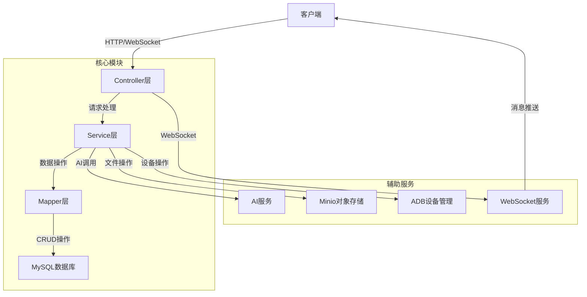
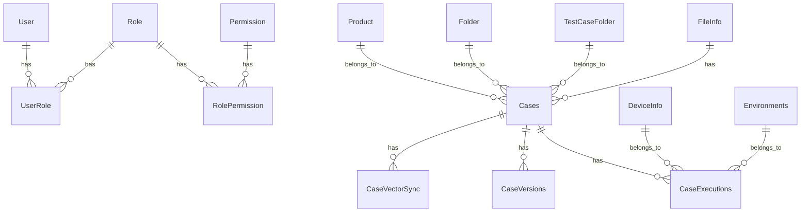

# 技术方案设计文档

## 1. 系统架构图



## 2. 技术选型

| 类别 | 技术 | 版本 | 说明 |
|------|------|------|------|
| 基础框架 | Spring Boot | 2.7.18 | 提供自动配置和快速开发能力 |
| 安全框架 | Spring Security | 2.7.18 | 提供认证和授权功能 |
| 数据访问 | MyBatis Flex | 1.11.3 | 轻量级ORM框架，提供代码生成能力 |
| 数据库 | MySQL | 8.2.0 | 关系型数据库，存储业务数据 |
| 缓存 | - | - | 暂未使用缓存 |
| 消息队列 | - | - | 暂未使用消息队列 |
| 对象存储 | Minio | 8.2.2 | 存储文件和图片 |
| WebSocket | Spring WebSocket | 2.7.18 | 提供实时通信能力 |
| AI服务 | Spark API | - | 提供AI对话和嵌入能力 |
| 设备管理 | ADB | 32.0.0 | 管理Android设备 |
| 文档解析 | Apache Tika | 2.9.1 | 解析文档内容 |
| JSON处理 | FastJSON | 1.2.83 | 处理JSON数据 |
| HTTP客户端 | OkHttp3 | 4.12.0 | 发送HTTP请求 |
| 工具库 | Hutool | 5.8.35 | 提供常用工具类 |
| 文档生成 | SpringDoc | 1.7.0 | 生成API文档 |

## 3. 数据库设计

### 3.1 实体关系图 (ER图)



### 3.2 核心表结构

| 表名 | 说明 | 关键字段 |
|------|------|----------|
| User | 用户表 | id, username, password, email, create_time |
| Role | 角色表 | id, role_name, description, create_time |
| Permission | 权限表 | id, permission_name, description, create_time |
| UserRole | 用户角色关联表 | id, user_id, role_id |
| RolePermission | 角色权限关联表 | id, role_id, permission_id |
| Product | 产品表 | id, product_name, description, create_time |
| Cases | 测试用例表 | id, case_name, product_id, folder_id, test_case_folder_id, create_time |
| CaseVersions | 测试用例版本表 | id, case_id, version, content, create_time |
| CaseExecutions | 测试用例执行表 | id, case_id, device_id, environment_id, status, start_time, end_time |
| Folder | 文件夹表 | id, folder_name, parent_id, create_time |
| TestCaseFolder | 测试用例文件夹表 | id, folder_name, parent_id, create_time |
| CaseVectorSync | 测试用例向量同步表 | id, case_id, vector_id, sync_time |
| DeviceInfo | 设备信息表 | id, device_name, device_id, status, create_time |
| Environments | 环境信息表 | id, environment_name, description, create_time |
| FileInfo | 文件信息表 | id, file_name, file_path, file_size, create_time |

## 4. 模块划分

### 4.1 核心模块

| 模块 | 包路径 | 说明 | 主要功能 |
|------|--------|------|----------|
| 控制器层 | com.grape.grape.controller | 处理HTTP请求和WebSocket连接 | 提供API接口，处理请求参数，返回响应结果 |
| 服务层 | com.grape.grape.service | 业务逻辑处理 | 实现核心业务逻辑，调用数据访问层 |
| 数据访问层 | com.grape.grape.mapper | 数据库操作 | 执行SQL语句，操作数据库 |
| 实体层 | com.grape.grape.entity | 数据模型定义 | 定义数据库表对应的实体类 |
| 模型层 | com.grape.grape.model | 数据传输对象 | 定义请求和响应的数据结构 |
| 配置层 | com.grape.grape.config | 系统配置 | 配置Spring Bean，安全设置等 |
| 工具层 | com.grape.grape.utils | 工具类 | 提供通用工具方法 |
| WebSocket | com.grape.grape.websocket | WebSocket处理 | 处理实时通信 |

### 4.2 辅助模块

| 模块 | 包路径 | 说明 | 主要功能 |
|------|--------|------|----------|
| AI服务 | com.grape.grape.service.ai | AI相关服务 | 调用AI API，处理AI对话和嵌入 |
| 业务服务 | com.grape.grape.service.biz | 业务逻辑实现 | 实现具体业务功能 |
| 实现服务 | com.grape.grape.service.impl | 服务实现 | 实现接口定义的方法 |
| 设备管理 | com.grape.grape.service.phone | 设备管理 | 管理Android设备 |
| Android工具 | com.grape.grape.utils.android | Android相关工具 | 提供Android设备操作工具 |
| Scrcpy工具 | com.grape.grape.utils.scrcpy | 屏幕镜像工具 | 实现屏幕镜像功能 |

## 5. 关键算法说明

### 5.1 测试用例AI生成算法

**功能**：根据用户输入的需求，使用AI生成测试用例

**流程**：
1. 接收用户输入的测试需求
2. 调用Spark AI API生成测试用例
3. 解析AI返回的测试用例内容
4. 存储测试用例到数据库
5. 生成测试用例向量并同步到Qdrant向量数据库

**关键代码**：
- `AiBizServiceImpl.generateTestCase()`：处理测试用例生成逻辑
- `B_WsXModel`：处理AI对话逻辑
- `SparkEmbeddingClient`：处理文本嵌入逻辑

### 5.2 测试场景Excel解析算法

**功能**：解析Excel文件，提取测试场景和步骤

**流程**：
1. 读取Excel文件内容
2. 解析工作表结构
3. 提取测试场景和步骤
4. 合并相同场景的内容
5. 生成测试用例数据

**关键代码**：
- `ExcelToTestScenarioTest`：处理Excel解析逻辑

### 5.3 设备坐标获取算法

**功能**：获取Android设备的屏幕坐标

**流程**：
1. 执行ADB命令获取设备屏幕分辨率
2. 监听设备触摸事件
3. 解析触摸事件获取坐标
4. 转换坐标到屏幕坐标系

**关键代码**：
- `getCoor`：处理坐标获取逻辑
- `method.dealSpace()`：处理命令输出的空格

### 5.4 WebSocket消息处理算法

**功能**：处理WebSocket连接和消息

**流程**：
1. 建立WebSocket连接
2. 处理客户端消息
3. 根据消息类型执行不同操作
4. 推送消息到客户端

**关键代码**：
- `WebSocketController`：处理WebSocket连接和消息
- `ScreenStreamEndpoint`：处理屏幕流传输

### 5.5 Qdrant向量同步算法

**功能**：同步测试用例向量到Qdrant向量数据库

**流程**：
1. 读取测试用例数据
2. 生成文本嵌入向量
3. 同步向量到Qdrant
4. 记录同步状态

**关键代码**：
- `QdrantSyncService`：处理向量同步逻辑
- `SparkEmbeddingClient`：生成文本嵌入

## 6. 项目结构

```
grape-server/
├── src/
│   ├── main/
│   │   ├── java/com/grape/grape/
│   │   │   ├── component/        # 组件
│   │   │   ├── config/           # 配置
│   │   │   ├── controller/       # 控制器
│   │   │   ├── entity/           # 实体
│   │   │   ├── enums/            # 枚举
│   │   │   ├── exception/        # 异常处理
│   │   │   ├── mapper/           # 数据访问
│   │   │   ├── model/            # 模型
│   │   │   ├── service/          # 服务
│   │   │   ├── utils/            # 工具
│   │   │   ├── websocket/        # WebSocket
│   │   │   └── GrapeApplication.java  # 应用入口
│   │   └── resources/            # 资源文件
│   └── test/                     # 测试代码
├── docs/                         # 文档
├── pom.xml                       # Maven配置
└── 启动说明.md                    # 启动说明
```

## 7. 部署方案

### 7.1 环境要求

| 环境 | 版本 | 说明 |
|------|------|------|
| JDK | 17+ | 运行Spring Boot应用 |
| Maven | 3.6+ | 构建项目 |
| MySQL | 8.0+ | 存储数据 |
| Minio | 8.0+ | 存储文件 |
| Qdrant | 1.0+ | 存储向量数据 |
| ADB | 32.0+ | 管理Android设备 |

### 7.2 部署步骤

1. 克隆代码仓库
2. 配置数据库连接
3. 配置Minio连接
4. 配置Qdrant连接
5. 构建项目：`mvn clean package`
6. 运行应用：`java -jar grape-0.0.1-SNAPSHOT.jar`

### 7.3 启动脚本

项目根目录提供了 `deploy-to-server.bat` 脚本，用于部署到服务器。

## 8. 监控与维护

### 8.1 日志管理

- 使用Logback进行日志管理
- 日志文件存储在 `logs` 目录
- 包含应用日志、错误日志和访问日志

### 8.2 错误处理

- 全局异常处理器：`GlobalExceptionHandler`
- 统一返回格式：`Resp` 类
- 错误码定义：`ResultEnumI18n`

### 8.3 性能监控

- 可集成Spring Boot Actuator进行性能监控
- 可使用Prometheus和Grafana进行监控可视化

## 9. 未来规划

1. 增加自动化测试功能
2. 集成更多AI模型
3. 优化设备管理功能
4. 增加测试报告生成功能
5. 支持更多类型的测试用例生成
6. 优化向量数据库查询性能
