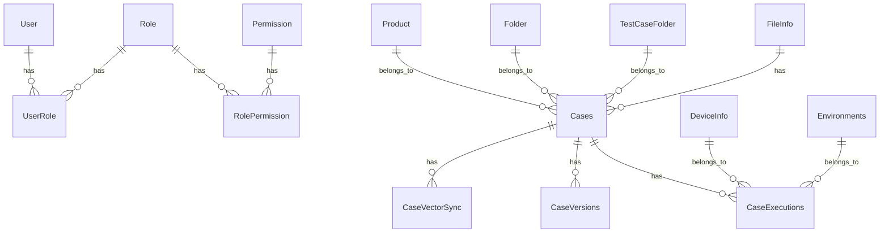

# 数据库设计文档

## 1. 表结构设计

### 1.1 User表（用户表）

| 字段名 | 数据类型 | 约束 | 描述 |
|--------|----------|------|------|
| id | BIGINT | PRIMARY KEY, AUTO_INCREMENT | 用户ID |
| username | VARCHAR(50) | NOT NULL, UNIQUE | 用户名 |
| password | VARCHAR(100) | NOT NULL | 密码（加密存储） |
| email | VARCHAR(100) | UNIQUE | 邮箱 |
| create_time | DATETIME | NOT NULL, DEFAULT CURRENT_TIMESTAMP | 创建时间 |
| update_time | DATETIME | DEFAULT CURRENT_TIMESTAMP ON UPDATE CURRENT_TIMESTAMP | 更新时间 |
| status | INT | NOT NULL, DEFAULT 1 | 状态（1: 启用, 0: 禁用） |

### 1.2 Role表（角色表）

| 字段名 | 数据类型 | 约束 | 描述 |
|--------|----------|------|------|
| id | BIGINT | PRIMARY KEY, AUTO_INCREMENT | 角色ID |
| role_name | VARCHAR(50) | NOT NULL, UNIQUE | 角色名称 |
| description | VARCHAR(200) | | 角色描述 |
| create_time | DATETIME | NOT NULL, DEFAULT CURRENT_TIMESTAMP | 创建时间 |
| update_time | DATETIME | DEFAULT CURRENT_TIMESTAMP ON UPDATE CURRENT_TIMESTAMP | 更新时间 |
| status | INT | NOT NULL, DEFAULT 1 | 状态（1: 启用, 0: 禁用） |

### 1.3 Permission表（权限表）

| 字段名 | 数据类型 | 约束 | 描述 |
|--------|----------|------|------|
| id | BIGINT | PRIMARY KEY, AUTO_INCREMENT | 权限ID |
| permission_name | VARCHAR(50) | NOT NULL, UNIQUE | 权限名称 |
| description | VARCHAR(200) | | 权限描述 |
| create_time | DATETIME | NOT NULL, DEFAULT CURRENT_TIMESTAMP | 创建时间 |
| update_time | DATETIME | DEFAULT CURRENT_TIMESTAMP ON UPDATE CURRENT_TIMESTAMP | 更新时间 |

### 1.4 UserRole表（用户角色关联表）

| 字段名 | 数据类型 | 约束 | 描述 |
|--------|----------|------|------|
| id | BIGINT | PRIMARY KEY, AUTO_INCREMENT | 关联ID |
| user_id | BIGINT | NOT NULL, FOREIGN KEY REFERENCES User(id) | 用户ID |
| role_id | BIGINT | NOT NULL, FOREIGN KEY REFERENCES Role(id) | 角色ID |
| create_time | DATETIME | NOT NULL, DEFAULT CURRENT_TIMESTAMP | 创建时间 |

### 1.5 RolePermission表（角色权限关联表）

| 字段名 | 数据类型 | 约束 | 描述 |
|--------|----------|------|------|
| id | BIGINT | PRIMARY KEY, AUTO_INCREMENT | 关联ID |
| role_id | BIGINT | NOT NULL, FOREIGN KEY REFERENCES Role(id) | 角色ID |
| permission_id | BIGINT | NOT NULL, FOREIGN KEY REFERENCES Permission(id) | 权限ID |
| create_time | DATETIME | NOT NULL, DEFAULT CURRENT_TIMESTAMP | 创建时间 |

### 1.6 Product表（产品表）

| 字段名 | 数据类型 | 约束 | 描述 |
|--------|----------|------|------|
| id | BIGINT | PRIMARY KEY, AUTO_INCREMENT | 产品ID |
| product_name | VARCHAR(100) | NOT NULL, UNIQUE | 产品名称 |
| description | VARCHAR(500) | | 产品描述 |
| create_time | DATETIME | NOT NULL, DEFAULT CURRENT_TIMESTAMP | 创建时间 |
| update_time | DATETIME | DEFAULT CURRENT_TIMESTAMP ON UPDATE CURRENT_TIMESTAMP | 更新时间 |
| status | INT | NOT NULL, DEFAULT 1 | 状态（1: 启用, 0: 禁用） |

### 1.7 Cases表（测试用例表）

| 字段名 | 数据类型 | 约束 | 描述 |
|--------|----------|------|------|
| id | BIGINT | PRIMARY KEY, AUTO_INCREMENT | 测试用例ID |
| case_name | VARCHAR(200) | NOT NULL | 测试用例名称 |
| product_id | BIGINT | FOREIGN KEY REFERENCES Product(id) | 产品ID |
| folder_id | BIGINT | FOREIGN KEY REFERENCES Folder(id) | 文件夹ID |
| test_case_folder_id | BIGINT | FOREIGN KEY REFERENCES TestCaseFolder(id) | 测试用例文件夹ID |
| content | TEXT | | 测试用例内容 |
| create_time | DATETIME | NOT NULL, DEFAULT CURRENT_TIMESTAMP | 创建时间 |
| update_time | DATETIME | DEFAULT CURRENT_TIMESTAMP ON UPDATE CURRENT_TIMESTAMP | 更新时间 |
| status | INT | NOT NULL, DEFAULT 1 | 状态（1: 启用, 0: 禁用） |

### 1.8 CaseVersions表（测试用例版本表）

| 字段名 | 数据类型 | 约束 | 描述 |
|--------|----------|------|------|
| id | BIGINT | PRIMARY KEY, AUTO_INCREMENT | 版本ID |
| case_id | BIGINT | NOT NULL, FOREIGN KEY REFERENCES Cases(id) | 测试用例ID |
| version | VARCHAR(50) | NOT NULL | 版本号 |
| content | TEXT | | 版本内容 |
| create_time | DATETIME | NOT NULL, DEFAULT CURRENT_TIMESTAMP | 创建时间 |
| create_user | BIGINT | FOREIGN KEY REFERENCES User(id) | 创建用户ID |

### 1.9 CaseExecutions表（测试用例执行表）

| 字段名 | 数据类型 | 约束 | 描述 |
|--------|----------|------|------|
| id | BIGINT | PRIMARY KEY, AUTO_INCREMENT | 执行ID |
| case_id | BIGINT | NOT NULL, FOREIGN KEY REFERENCES Cases(id) | 测试用例ID |
| device_id | BIGINT | FOREIGN KEY REFERENCES DeviceInfo(id) | 设备ID |
| environment_id | BIGINT | FOREIGN KEY REFERENCES Environments(id) | 环境ID |
| status | VARCHAR(20) | NOT NULL | 执行状态（pending, running, success, failed） |
| start_time | DATETIME | | 开始时间 |
| end_time | DATETIME | | 结束时间 |
| result | TEXT | | 执行结果 |
| create_time | DATETIME | NOT NULL, DEFAULT CURRENT_TIMESTAMP | 创建时间 |

### 1.10 Folder表（文件夹表）

| 字段名 | 数据类型 | 约束 | 描述 |
|--------|----------|------|------|
| id | BIGINT | PRIMARY KEY, AUTO_INCREMENT | 文件夹ID |
| folder_name | VARCHAR(100) | NOT NULL | 文件夹名称 |
| parent_id | BIGINT | FOREIGN KEY REFERENCES Folder(id) | 父文件夹ID |
| create_time | DATETIME | NOT NULL, DEFAULT CURRENT_TIMESTAMP | 创建时间 |
| update_time | DATETIME | DEFAULT CURRENT_TIMESTAMP ON UPDATE CURRENT_TIMESTAMP | 更新时间 |

### 1.11 TestCaseFolder表（测试用例文件夹表）

| 字段名 | 数据类型 | 约束 | 描述 |
|--------|----------|------|------|
| id | BIGINT | PRIMARY KEY, AUTO_INCREMENT | 测试用例文件夹ID |
| folder_name | VARCHAR(100) | NOT NULL | 文件夹名称 |
| parent_id | BIGINT | FOREIGN KEY REFERENCES TestCaseFolder(id) | 父文件夹ID |
| create_time | DATETIME | NOT NULL, DEFAULT CURRENT_TIMESTAMP | 创建时间 |
| update_time | DATETIME | DEFAULT CURRENT_TIMESTAMP ON UPDATE CURRENT_TIMESTAMP | 更新时间 |

### 1.12 CaseVectorSync表（测试用例向量同步表）

| 字段名 | 数据类型 | 约束 | 描述 |
|--------|----------|------|------|
| id | BIGINT | PRIMARY KEY, AUTO_INCREMENT | 同步ID |
| case_id | BIGINT | NOT NULL, FOREIGN KEY REFERENCES Cases(id) | 测试用例ID |
| vector_id | VARCHAR(100) | NOT NULL | 向量ID |
| sync_time | DATETIME | NOT NULL, DEFAULT CURRENT_TIMESTAMP | 同步时间 |
| status | INT | NOT NULL, DEFAULT 1 | 同步状态（1: 成功, 0: 失败） |

### 1.13 DeviceInfo表（设备信息表）

| 字段名 | 数据类型 | 约束 | 描述 |
|--------|----------|------|------|
| id | BIGINT | PRIMARY KEY, AUTO_INCREMENT | 设备ID |
| device_name | VARCHAR(100) | NOT NULL | 设备名称 |
| device_id | VARCHAR(100) | NOT NULL, UNIQUE | 设备唯一标识 |
| device_type | VARCHAR(50) | | 设备类型 |
| status | INT | NOT NULL, DEFAULT 1 | 状态（1: 在线, 0: 离线） |
| create_time | DATETIME | NOT NULL, DEFAULT CURRENT_TIMESTAMP | 创建时间 |
| update_time | DATETIME | DEFAULT CURRENT_TIMESTAMP ON UPDATE CURRENT_TIMESTAMP | 更新时间 |

### 1.14 Environments表（环境信息表）

| 字段名 | 数据类型 | 约束 | 描述 |
|--------|----------|------|------|
| id | BIGINT | PRIMARY KEY, AUTO_INCREMENT | 环境ID |
| environment_name | VARCHAR(100) | NOT NULL, UNIQUE | 环境名称 |
| description | VARCHAR(500) | | 环境描述 |
| create_time | DATETIME | NOT NULL, DEFAULT CURRENT_TIMESTAMP | 创建时间 |
| update_time | DATETIME | DEFAULT CURRENT_TIMESTAMP ON UPDATE CURRENT_TIMESTAMP | 更新时间 |
| status | INT | NOT NULL, DEFAULT 1 | 状态（1: 启用, 0: 禁用） |

### 1.15 FileInfo表（文件信息表）

| 字段名 | 数据类型 | 约束 | 描述 |
|--------|----------|------|------|
| id | BIGINT | PRIMARY KEY, AUTO_INCREMENT | 文件ID |
| file_name | VARCHAR(200) | NOT NULL | 文件名 |
| file_path | VARCHAR(500) | NOT NULL | 文件路径 |
| file_size | BIGINT | NOT NULL | 文件大小（字节） |
| file_type | VARCHAR(50) | | 文件类型 |
| create_time | DATETIME | NOT NULL, DEFAULT CURRENT_TIMESTAMP | 创建时间 |
| update_time | DATETIME | DEFAULT CURRENT_TIMESTAMP ON UPDATE CURRENT_TIMESTAMP | 更新时间 |
| status | INT | NOT NULL, DEFAULT 1 | 状态（1: 可用, 0: 不可用） |

## 2. 索引设计

### 2.1 User表索引

| 索引名称 | 索引类型 | 索引字段 | 描述 |
|----------|----------|----------|------|
| PRIMARY | PRIMARY KEY | id | 主键索引 |
| idx_username | UNIQUE | username | 唯一索引，加速用户名查询 |
| idx_email | UNIQUE | email | 唯一索引，加速邮箱查询 |
| idx_status | INDEX | status | 普通索引，加速状态查询 |

### 2.2 Role表索引

| 索引名称 | 索引类型 | 索引字段 | 描述 |
|----------|----------|----------|------|
| PRIMARY | PRIMARY KEY | id | 主键索引 |
| idx_role_name | UNIQUE | role_name | 唯一索引，加速角色名称查询 |
| idx_status | INDEX | status | 普通索引，加速状态查询 |

### 2.3 Permission表索引

| 索引名称 | 索引类型 | 索引字段 | 描述 |
|----------|----------|----------|------|
| PRIMARY | PRIMARY KEY | id | 主键索引 |
| idx_permission_name | UNIQUE | permission_name | 唯一索引，加速权限名称查询 |

### 2.4 UserRole表索引

| 索引名称 | 索引类型 | 索引字段 | 描述 |
|----------|----------|----------|------|
| PRIMARY | PRIMARY KEY | id | 主键索引 |
| idx_user_id | INDEX | user_id | 普通索引，加速用户ID查询 |
| idx_role_id | INDEX | role_id | 普通索引，加速角色ID查询 |
| idx_user_role | UNIQUE | (user_id, role_id) | 唯一索引，确保用户-角色组合唯一 |

### 2.5 RolePermission表索引

| 索引名称 | 索引类型 | 索引字段 | 描述 |
|----------|----------|----------|------|
| PRIMARY | PRIMARY KEY | id | 主键索引 |
| idx_role_id | INDEX | role_id | 普通索引，加速角色ID查询 |
| idx_permission_id | INDEX | permission_id | 普通索引，加速权限ID查询 |
| idx_role_permission | UNIQUE | (role_id, permission_id) | 唯一索引，确保角色-权限组合唯一 |

### 2.6 Product表索引

| 索引名称 | 索引类型 | 索引字段 | 描述 |
|----------|----------|----------|------|
| PRIMARY | PRIMARY KEY | id | 主键索引 |
| idx_product_name | UNIQUE | product_name | 唯一索引，加速产品名称查询 |
| idx_status | INDEX | status | 普通索引，加速状态查询 |

### 2.7 Cases表索引

| 索引名称 | 索引类型 | 索引字段 | 描述 |
|----------|----------|----------|------|
| PRIMARY | PRIMARY KEY | id | 主键索引 |
| idx_product_id | INDEX | product_id | 普通索引，加速产品ID查询 |
| idx_folder_id | INDEX | folder_id | 普通索引，加速文件夹ID查询 |
| idx_test_case_folder_id | INDEX | test_case_folder_id | 普通索引，加速测试用例文件夹ID查询 |
| idx_status | INDEX | status | 普通索引，加速状态查询 |

### 2.8 CaseVersions表索引

| 索引名称 | 索引类型 | 索引字段 | 描述 |
|----------|----------|----------|------|
| PRIMARY | PRIMARY KEY | id | 主键索引 |
| idx_case_id | INDEX | case_id | 普通索引，加速测试用例ID查询 |
| idx_case_version | UNIQUE | (case_id, version) | 唯一索引，确保测试用例版本唯一 |

### 2.9 CaseExecutions表索引

| 索引名称 | 索引类型 | 索引字段 | 描述 |
|----------|----------|----------|------|
| PRIMARY | PRIMARY KEY | id | 主键索引 |
| idx_case_id | INDEX | case_id | 普通索引，加速测试用例ID查询 |
| idx_device_id | INDEX | device_id | 普通索引，加速设备ID查询 |
| idx_environment_id | INDEX | environment_id | 普通索引，加速环境ID查询 |
| idx_status | INDEX | status | 普通索引，加速状态查询 |
| idx_start_time | INDEX | start_time | 普通索引，加速开始时间查询 |

### 2.10 Folder表索引

| 索引名称 | 索引类型 | 索引字段 | 描述 |
|----------|----------|----------|------|
| PRIMARY | PRIMARY KEY | id | 主键索引 |
| idx_parent_id | INDEX | parent_id | 普通索引，加速父文件夹ID查询 |

### 2.11 TestCaseFolder表索引

| 索引名称 | 索引类型 | 索引字段 | 描述 |
|----------|----------|----------|------|
| PRIMARY | PRIMARY KEY | id | 主键索引 |
| idx_parent_id | INDEX | parent_id | 普通索引，加速父文件夹ID查询 |

### 2.12 CaseVectorSync表索引

| 索引名称 | 索引类型 | 索引字段 | 描述 |
|----------|----------|----------|------|
| PRIMARY | PRIMARY KEY | id | 主键索引 |
| idx_case_id | INDEX | case_id | 普通索引，加速测试用例ID查询 |
| idx_vector_id | INDEX | vector_id | 普通索引，加速向量ID查询 |
| idx_status | INDEX | status | 普通索引，加速状态查询 |

### 2.13 DeviceInfo表索引

| 索引名称 | 索引类型 | 索引字段 | 描述 |
|----------|----------|----------|------|
| PRIMARY | PRIMARY KEY | id | 主键索引 |
| idx_device_id | UNIQUE | device_id | 唯一索引，加速设备唯一标识查询 |
| idx_status | INDEX | status | 普通索引，加速状态查询 |

### 2.14 Environments表索引

| 索引名称 | 索引类型 | 索引字段 | 描述 |
|----------|----------|----------|------|
| PRIMARY | PRIMARY KEY | id | 主键索引 |
| idx_environment_name | UNIQUE | environment_name | 唯一索引，加速环境名称查询 |
| idx_status | INDEX | status | 普通索引，加速状态查询 |

### 2.15 FileInfo表索引

| 索引名称 | 索引类型 | 索引字段 | 描述 |
|----------|----------|----------|------|
| PRIMARY | PRIMARY KEY | id | 主键索引 |
| idx_file_path | INDEX | file_path | 普通索引，加速文件路径查询 |
| idx_status | INDEX | status | 普通索引，加速状态查询 |

## 3. 表关系图



## 4. SQL脚本示例

### 4.1 创建数据库

```sql
CREATE DATABASE IF NOT EXISTS grape_server DEFAULT CHARACTER SET utf8mb4 COLLATE utf8mb4_unicode_ci;
USE grape_server;
```

### 4.2 创建User表

```sql
CREATE TABLE IF NOT EXISTS `User` (
  `id` BIGINT NOT NULL AUTO_INCREMENT,
  `username` VARCHAR(50) NOT NULL,
  `password` VARCHAR(100) NOT NULL,
  `email` VARCHAR(100) DEFAULT NULL,
  `create_time` DATETIME NOT NULL DEFAULT CURRENT_TIMESTAMP,
  `update_time` DATETIME DEFAULT CURRENT_TIMESTAMP ON UPDATE CURRENT_TIMESTAMP,
  `status` INT NOT NULL DEFAULT 1,
  PRIMARY KEY (`id`),
  UNIQUE KEY `idx_username` (`username`),
  UNIQUE KEY `idx_email` (`email`),
  KEY `idx_status` (`status`)
) ENGINE=InnoDB DEFAULT CHARSET=utf8mb4 COLLATE=utf8mb4_unicode_ci;
```

### 4.3 创建Role表

```sql
CREATE TABLE IF NOT EXISTS `Role` (
  `id` BIGINT NOT NULL AUTO_INCREMENT,
  `role_name` VARCHAR(50) NOT NULL,
  `description` VARCHAR(200) DEFAULT NULL,
  `create_time` DATETIME NOT NULL DEFAULT CURRENT_TIMESTAMP,
  `update_time` DATETIME DEFAULT CURRENT_TIMESTAMP ON UPDATE CURRENT_TIMESTAMP,
  `status` INT NOT NULL DEFAULT 1,
  PRIMARY KEY (`id`),
  UNIQUE KEY `idx_role_name` (`role_name`),
  KEY `idx_status` (`status`)
) ENGINE=InnoDB DEFAULT CHARSET=utf8mb4 COLLATE=utf8mb4_unicode_ci;
```

### 4.4 创建Permission表

```sql
CREATE TABLE IF NOT EXISTS `Permission` (
  `id` BIGINT NOT NULL AUTO_INCREMENT,
  `permission_name` VARCHAR(50) NOT NULL,
  `description` VARCHAR(200) DEFAULT NULL,
  `create_time` DATETIME NOT NULL DEFAULT CURRENT_TIMESTAMP,
  `update_time` DATETIME DEFAULT CURRENT_TIMESTAMP ON UPDATE CURRENT_TIMESTAMP,
  PRIMARY KEY (`id`),
  UNIQUE KEY `idx_permission_name` (`permission_name`)
) ENGINE=InnoDB DEFAULT CHARSET=utf8mb4 COLLATE=utf8mb4_unicode_ci;
```

### 4.5 创建UserRole表

```sql
CREATE TABLE IF NOT EXISTS `UserRole` (
  `id` BIGINT NOT NULL AUTO_INCREMENT,
  `user_id` BIGINT NOT NULL,
  `role_id` BIGINT NOT NULL,
  `create_time` DATETIME NOT NULL DEFAULT CURRENT_TIMESTAMP,
  PRIMARY KEY (`id`),
  KEY `idx_user_id` (`user_id`),
  KEY `idx_role_id` (`role_id`),
  UNIQUE KEY `idx_user_role` (`user_id`, `role_id`),
  CONSTRAINT `fk_user_role_user` FOREIGN KEY (`user_id`) REFERENCES `User` (`id`) ON DELETE CASCADE ON UPDATE CASCADE,
  CONSTRAINT `fk_user_role_role` FOREIGN KEY (`role_id`) REFERENCES `Role` (`id`) ON DELETE CASCADE ON UPDATE CASCADE
) ENGINE=InnoDB DEFAULT CHARSET=utf8mb4 COLLATE=utf8mb4_unicode_ci;
```

### 4.6 创建RolePermission表

```sql
CREATE TABLE IF NOT EXISTS `RolePermission` (
  `id` BIGINT NOT NULL AUTO_INCREMENT,
  `role_id` BIGINT NOT NULL,
  `permission_id` BIGINT NOT NULL,
  `create_time` DATETIME NOT NULL DEFAULT CURRENT_TIMESTAMP,
  PRIMARY KEY (`id`),
  KEY `idx_role_id` (`role_id`),
  KEY `idx_permission_id` (`permission_id`),
  UNIQUE KEY `idx_role_permission` (`role_id`, `permission_id`),
  CONSTRAINT `fk_role_permission_role` FOREIGN KEY (`role_id`) REFERENCES `Role` (`id`) ON DELETE CASCADE ON UPDATE CASCADE,
  CONSTRAINT `fk_role_permission_permission` FOREIGN KEY (`permission_id`) REFERENCES `Permission` (`id`) ON DELETE CASCADE ON UPDATE CASCADE
) ENGINE=InnoDB DEFAULT CHARSET=utf8mb4 COLLATE=utf8mb4_unicode_ci;
```

### 4.7 创建Product表

```sql
CREATE TABLE IF NOT EXISTS `Product` (
  `id` BIGINT NOT NULL AUTO_INCREMENT,
  `product_name` VARCHAR(100) NOT NULL,
  `description` VARCHAR(500) DEFAULT NULL,
  `create_time` DATETIME NOT NULL DEFAULT CURRENT_TIMESTAMP,
  `update_time` DATETIME DEFAULT CURRENT_TIMESTAMP ON UPDATE CURRENT_TIMESTAMP,
  `status` INT NOT NULL DEFAULT 1,
  PRIMARY KEY (`id`),
  UNIQUE KEY `idx_product_name` (`product_name`),
  KEY `idx_status` (`status`)
) ENGINE=InnoDB DEFAULT CHARSET=utf8mb4 COLLATE=utf8mb4_unicode_ci;
```

### 4.8 创建Folder表

```sql
CREATE TABLE IF NOT EXISTS `Folder` (
  `id` BIGINT NOT NULL AUTO_INCREMENT,
  `folder_name` VARCHAR(100) NOT NULL,
  `parent_id` BIGINT DEFAULT NULL,
  `create_time` DATETIME NOT NULL DEFAULT CURRENT_TIMESTAMP,
  `update_time` DATETIME DEFAULT CURRENT_TIMESTAMP ON UPDATE CURRENT_TIMESTAMP,
  PRIMARY KEY (`id`),
  KEY `idx_parent_id` (`parent_id`),
  CONSTRAINT `fk_folder_parent` FOREIGN KEY (`parent_id`) REFERENCES `Folder` (`id`) ON DELETE CASCADE ON UPDATE CASCADE
) ENGINE=InnoDB DEFAULT CHARSET=utf8mb4 COLLATE=utf8mb4_unicode_ci;
```

### 4.9 创建TestCaseFolder表

```sql
CREATE TABLE IF NOT EXISTS `TestCaseFolder` (
  `id` BIGINT NOT NULL AUTO_INCREMENT,
  `folder_name` VARCHAR(100) NOT NULL,
  `parent_id` BIGINT DEFAULT NULL,
  `create_time` DATETIME NOT NULL DEFAULT CURRENT_TIMESTAMP,
  `update_time` DATETIME DEFAULT CURRENT_TIMESTAMP ON UPDATE CURRENT_TIMESTAMP,
  PRIMARY KEY (`id`),
  KEY `idx_parent_id` (`parent_id`),
  CONSTRAINT `fk_test_case_folder_parent` FOREIGN KEY (`parent_id`) REFERENCES `TestCaseFolder` (`id`) ON DELETE CASCADE ON UPDATE CASCADE
) ENGINE=InnoDB DEFAULT CHARSET=utf8mb4 COLLATE=utf8mb4_unicode_ci;
```

### 4.10 创建Cases表

```sql
CREATE TABLE IF NOT EXISTS `Cases` (
  `id` BIGINT NOT NULL AUTO_INCREMENT,
  `case_name` VARCHAR(200) NOT NULL,
  `product_id` BIGINT DEFAULT NULL,
  `folder_id` BIGINT DEFAULT NULL,
  `test_case_folder_id` BIGINT DEFAULT NULL,
  `content` TEXT,
  `create_time` DATETIME NOT NULL DEFAULT CURRENT_TIMESTAMP,
  `update_time` DATETIME DEFAULT CURRENT_TIMESTAMP ON UPDATE CURRENT_TIMESTAMP,
  `status` INT NOT NULL DEFAULT 1,
  PRIMARY KEY (`id`),
  KEY `idx_product_id` (`product_id`),
  KEY `idx_folder_id` (`folder_id`),
  KEY `idx_test_case_folder_id` (`test_case_folder_id`),
  KEY `idx_status` (`status`),
  CONSTRAINT `fk_cases_product` FOREIGN KEY (`product_id`) REFERENCES `Product` (`id`) ON DELETE SET NULL ON UPDATE CASCADE,
  CONSTRAINT `fk_cases_folder` FOREIGN KEY (`folder_id`) REFERENCES `Folder` (`id`) ON DELETE SET NULL ON UPDATE CASCADE,
  CONSTRAINT `fk_cases_test_case_folder` FOREIGN KEY (`test_case_folder_id`) REFERENCES `TestCaseFolder` (`id`) ON DELETE SET NULL ON UPDATE CASCADE
) ENGINE=InnoDB DEFAULT CHARSET=utf8mb4 COLLATE=utf8mb4_unicode_ci;
```

### 4.11 创建CaseVersions表

```sql
CREATE TABLE IF NOT EXISTS `CaseVersions` (
  `id` BIGINT NOT NULL AUTO_INCREMENT,
  `case_id` BIGINT NOT NULL,
  `version` VARCHAR(50) NOT NULL,
  `content` TEXT,
  `create_time` DATETIME NOT NULL DEFAULT CURRENT_TIMESTAMP,
  `create_user` BIGINT DEFAULT NULL,
  PRIMARY KEY (`id`),
  KEY `idx_case_id` (`case_id`),
  UNIQUE KEY `idx_case_version` (`case_id`, `version`),
  CONSTRAINT `fk_case_versions_case` FOREIGN KEY (`case_id`) REFERENCES `Cases` (`id`) ON DELETE CASCADE ON UPDATE CASCADE,
  CONSTRAINT `fk_case_versions_user` FOREIGN KEY (`create_user`) REFERENCES `User` (`id`) ON DELETE SET NULL ON UPDATE CASCADE
) ENGINE=InnoDB DEFAULT CHARSET=utf8mb4 COLLATE=utf8mb4_unicode_ci;
```

### 4.12 创建DeviceInfo表

```sql
CREATE TABLE IF NOT EXISTS `DeviceInfo` (
  `id` BIGINT NOT NULL AUTO_INCREMENT,
  `device_name` VARCHAR(100) NOT NULL,
  `device_id` VARCHAR(100) NOT NULL,
  `device_type` VARCHAR(50) DEFAULT NULL,
  `status` INT NOT NULL DEFAULT 1,
  `create_time` DATETIME NOT NULL DEFAULT CURRENT_TIMESTAMP,
  `update_time` DATETIME DEFAULT CURRENT_TIMESTAMP ON UPDATE CURRENT_TIMESTAMP,
  PRIMARY KEY (`id`),
  UNIQUE KEY `idx_device_id` (`device_id`),
  KEY `idx_status` (`status`)
) ENGINE=InnoDB DEFAULT CHARSET=utf8mb4 COLLATE=utf8mb4_unicode_ci;
```

### 4.13 创建Environments表

```sql
CREATE TABLE IF NOT EXISTS `Environments` (
  `id` BIGINT NOT NULL AUTO_INCREMENT,
  `environment_name` VARCHAR(100) NOT NULL,
  `description` VARCHAR(500) DEFAULT NULL,
  `create_time` DATETIME NOT NULL DEFAULT CURRENT_TIMESTAMP,
  `update_time` DATETIME DEFAULT CURRENT_TIMESTAMP ON UPDATE CURRENT_TIMESTAMP,
  `status` INT NOT NULL DEFAULT 1,
  PRIMARY KEY (`id`),
  UNIQUE KEY `idx_environment_name` (`environment_name`),
  KEY `idx_status` (`status`)
) ENGINE=InnoDB DEFAULT CHARSET=utf8mb4 COLLATE=utf8mb4_unicode_ci;
```

### 4.14 创建CaseExecutions表

```sql
CREATE TABLE IF NOT EXISTS `CaseExecutions` (
  `id` BIGINT NOT NULL AUTO_INCREMENT,
  `case_id` BIGINT NOT NULL,
  `device_id` BIGINT DEFAULT NULL,
  `environment_id` BIGINT DEFAULT NULL,
  `status` VARCHAR(20) NOT NULL,
  `start_time` DATETIME DEFAULT NULL,
  `end_time` DATETIME DEFAULT NULL,
  `result` TEXT,
  `create_time` DATETIME NOT NULL DEFAULT CURRENT_TIMESTAMP,
  PRIMARY KEY (`id`),
  KEY `idx_case_id` (`case_id`),
  KEY `idx_device_id` (`device_id`),
  KEY `idx_environment_id` (`environment_id`),
  KEY `idx_status` (`status`),
  KEY `idx_start_time` (`start_time`),
  CONSTRAINT `fk_case_executions_case` FOREIGN KEY (`case_id`) REFERENCES `Cases` (`id`) ON DELETE CASCADE ON UPDATE CASCADE,
  CONSTRAINT `fk_case_executions_device` FOREIGN KEY (`device_id`) REFERENCES `DeviceInfo` (`id`) ON DELETE SET NULL ON UPDATE CASCADE,
  CONSTRAINT `fk_case_executions_environment` FOREIGN KEY (`environment_id`) REFERENCES `Environments` (`id`) ON DELETE SET NULL ON UPDATE CASCADE
) ENGINE=InnoDB DEFAULT CHARSET=utf8mb4 COLLATE=utf8mb4_unicode_ci;
```

### 4.15 创建CaseVectorSync表

```sql
CREATE TABLE IF NOT EXISTS `CaseVectorSync` (
  `id` BIGINT NOT NULL AUTO_INCREMENT,
  `case_id` BIGINT NOT NULL,
  `vector_id` VARCHAR(100) NOT NULL,
  `sync_time` DATETIME NOT NULL DEFAULT CURRENT_TIMESTAMP,
  `status` INT NOT NULL DEFAULT 1,
  PRIMARY KEY (`id`),
  KEY `idx_case_id` (`case_id`),
  KEY `idx_vector_id` (`vector_id`),
  KEY `idx_status` (`status`),
  CONSTRAINT `fk_case_vector_sync_case` FOREIGN KEY (`case_id`) REFERENCES `Cases` (`id`) ON DELETE CASCADE ON UPDATE CASCADE
) ENGINE=InnoDB DEFAULT CHARSET=utf8mb4 COLLATE=utf8mb4_unicode_ci;
```

### 4.16 创建FileInfo表

```sql
CREATE TABLE IF NOT EXISTS `FileInfo` (
  `id` BIGINT NOT NULL AUTO_INCREMENT,
  `file_name` VARCHAR(200) NOT NULL,
  `file_path` VARCHAR(500) NOT NULL,
  `file_size` BIGINT NOT NULL,
  `file_type` VARCHAR(50) DEFAULT NULL,
  `create_time` DATETIME NOT NULL DEFAULT CURRENT_TIMESTAMP,
  `update_time` DATETIME DEFAULT CURRENT_TIMESTAMP ON UPDATE CURRENT_TIMESTAMP,
  `status` INT NOT NULL DEFAULT 1,
  PRIMARY KEY (`id`),
  KEY `idx_file_path` (`file_path`),
  KEY `idx_status` (`status`)
) ENGINE=InnoDB DEFAULT CHARSET=utf8mb4 COLLATE=utf8mb4_unicode_ci;
```

### 4.17 插入初始数据

#### 4.17.1 插入默认角色

```sql
INSERT INTO `Role` (`role_name`, `description`) VALUES
('admin', '管理员角色'),
('user', '普通用户角色');
```

#### 4.17.2 插入默认权限

```sql
INSERT INTO `Permission` (`permission_name`, `description`) VALUES
('user:manage', '用户管理权限'),
('role:manage', '角色管理权限'),
('permission:manage', '权限管理权限'),
('product:manage', '产品管理权限'),
('case:manage', '测试用例管理权限'),
('execution:manage', '测试执行管理权限'),
('device:manage', '设备管理权限'),
('environment:manage', '环境管理权限'),
('file:manage', '文件管理权限');
```

#### 4.17.3 关联角色权限

```sql
-- 管理员角色拥有所有权限
INSERT INTO `RolePermission` (`role_id`, `permission_id`) VALUES
(1, 1),
(1, 2),
(1, 3),
(1, 4),
(1, 5),
(1, 6),
(1, 7),
(1, 8),
(1, 9);

-- 普通用户角色拥有部分权限
INSERT INTO `RolePermission` (`role_id`, `permission_id`) VALUES
(2, 5),
(2, 6);
```

#### 4.17.4 插入默认管理员用户

```sql
-- 密码为: admin123 (加密后)
INSERT INTO `User` (`username`, `password`, `email`) VALUES
('admin', '$2a$10$EixZaYVK1fsbw1ZfbX3OXePaWxn96p36WQoeG6Lruj3vjPGga31lW', 'admin@example.com');

-- 关联管理员角色
INSERT INTO `UserRole` (`user_id`, `role_id`) VALUES
(1, 1);
```

## 5. 数据库优化建议

### 5.1 性能优化

1. **索引优化**：根据查询频率和业务需求，合理创建索引，避免过多或过少的索引
2. **分区表**：对于大型表（如CaseExecutions），可以考虑使用分区表提高查询性能
3. **读写分离**：在高并发场景下，考虑使用主从复制实现读写分离
4. **缓存策略**：对于频繁查询的数据，考虑使用Redis等缓存

### 5.2 安全优化

1. **密码加密**：使用bcrypt等算法对密码进行加密存储
2. **SQL注入防护**：使用参数化查询，避免直接拼接SQL语句
3. **权限控制**：严格控制数据库用户权限，遵循最小权限原则
4. **数据备份**：定期进行数据库备份，确保数据安全

### 5.3 维护建议

1. **定期清理**：定期清理过期数据，如测试执行记录
2. **索引重建**：定期重建索引，提高查询性能
3. **监控**：监控数据库性能，及时发现并解决问题
4. **优化SQL**：定期分析慢查询，优化SQL语句

## 6. 数据库迁移方案

### 6.1 版本管理

使用Flyway或Liquibase等工具进行数据库版本管理，确保数据库结构的一致性和可追溯性。

### 6.2 迁移步骤

1. **备份现有数据库**
2. **创建迁移脚本**
3. **执行迁移脚本**
4. **验证数据完整性**
5. **更新应用配置**

### 6.3 回滚方案

1. **准备回滚脚本**
2. **在迁移失败时执行回滚**
3. **验证回滚结果**
